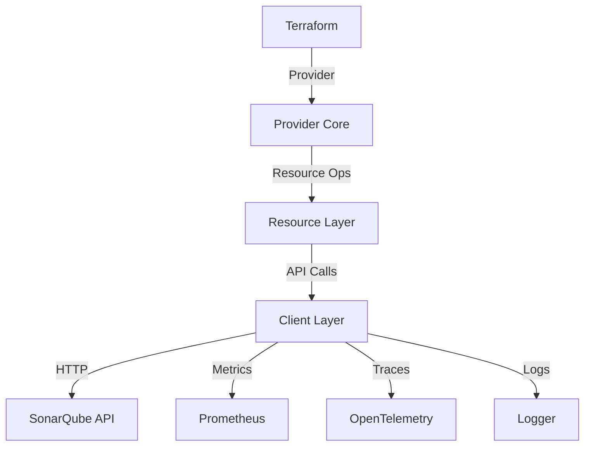

# Technical Documentation

This document provides technical details about the SonarQube Terraform provider implementation.

## Architecture

### Components

1. **Provider Core**
   - Main provider configuration
   - Resource registration
   - Authentication handling

2. **Client Layer**
   - HTTP client with retry mechanism
   - Request/response handling
   - Error handling
   - Telemetry integration

3. **Resource Layer**
   - CRUD operations for each resource type
   - State management
   - Schema definitions

4. **Testing Framework**
   - Integration tests
   - Unit tests
   - Test containers for SonarQube

### Flow Diagram



## Implementation Details

### Retry Mechanism

The provider implements a sophisticated retry mechanism with exponential backoff:

```go
type RetryConfig struct {
    MaxRetries  int
    WaitMin     time.Duration
    WaitMax     time.Duration
    RetryPolicy retryablehttp.CheckRetry
}
```

Default retry settings:
- Maximum retries: 3
- Minimum wait: 1 second
- Maximum wait: 30 seconds

### Error Handling

Errors are handled at multiple levels:

1. **HTTP Level**
   - Network errors
   - Invalid status codes
   - Timeout handling

2. **API Level**
   - Response validation
   - Error response parsing
   - Resource-specific errors

3. **Provider Level**
   - State consistency errors
   - Configuration validation
   - Resource dependency errors

### Telemetry

The provider includes comprehensive telemetry:

1. **Metrics**
   - API request duration
   - Operation counts
   - Error rates
   - Resource counts

2. **Tracing**
   - Request tracing
   - Operation tracking
   - Error tracking

3. **Logging**
   - Debug logging
   - Error logging
   - Audit logging

## Security

### Authentication

The provider supports two authentication methods:

1. **Token Authentication**
   ```hcl
   provider "sonarqube" {
     host  = "http://sonarqube.example.com"
     token = "your-token"
   }
   ```

2. **Environment Variables**
   ```bash
   export SONARQUBE_TOKEN="your-token"
   export SONARQUBE_HOST="http://sonarqube.example.com"
   ```

### Best Practices

1. **Token Management**
   - Use environment variables for tokens
   - Rotate tokens regularly
   - Use least privilege tokens

2. **API Access**
   - Use HTTPS endpoints
   - Implement rate limiting
   - Monitor API usage

3. **Resource Security**
   - Use private visibility by default
   - Implement proper permissions
   - Regular security audits

## Performance

### Optimizations

1. **Connection Pooling**
   - Reuse HTTP connections
   - Connection timeouts
   - Keep-alive settings

2. **Caching**
   - Response caching
   - Schema caching
   - Resource caching

3. **Batch Operations**
   - Bulk updates
   - Parallel operations
   - Resource grouping

### Resource Management

1. **State Management**
   - Efficient state storage
   - State locking
   - Conflict resolution

2. **Dependency Management**
   - Resource ordering
   - Dependency validation
   - Circular dependency detection

## Monitoring

### Metrics Available

| Metric Name | Type | Description |
|-------------|------|-------------|
| `sonarqube_api_request_duration_seconds` | Histogram | API request duration |
| `sonarqube_api_requests_total` | Counter | Total API requests |
| `sonarqube_resource_operations_total` | Counter | Resource operations |
| `sonarqube_resource_operation_errors_total` | Counter | Operation errors |

### Logging

Log levels available:
- DEBUG: Detailed debugging
- INFO: General information
- WARN: Warning messages
- ERROR: Error messages
- FATAL: Fatal errors

### Health Checks

The provider implements the following health checks:
1. API connectivity
2. Authentication validity
3. Resource accessibility
4. Rate limit status

## Troubleshooting

### Common Issues

1. **Authentication Failures**
   ```
   Error: Failed to authenticate with SonarQube
   Solution: Verify token validity and permissions
   ```

2. **Resource Conflicts**
   ```
   Error: Resource already exists
   Solution: Use import or handle existing resources
   ```

3. **API Rate Limits**
   ```
   Error: Too many requests
   Solution: Implement rate limiting or increase limits
   ```

### Debug Mode

Enable debug mode for detailed logging:

```hcl
provider "sonarqube" {
  debug = true
}
```

Or set environment variable:
```bash
export SONARQUBE_DEBUG=true
```

## Development Guide

### Setting Up Development Environment

1. Prerequisites:
   - Go 1.16+
   - Terraform 1.0+
   - Docker

2. Build Steps:
   ```bash
   make build
   make test
   make lint
   ```

3. Running Tests:
   ```bash
   # Unit tests
   make test
   
   # Integration tests
   make test-acc
   ```

### Contributing

1. Code Style
   - Follow Go style guide
   - Use consistent formatting
   - Write clear comments

2. Testing Requirements
   - Unit tests required
   - Integration tests for new features
   - >80% code coverage

3. Documentation
   - Update technical docs
   - Add example usage
   - Include changelog entry
